# Examples

Generated by `dotnet run --project tools/RenderExamples -- examples` at 40 pixels to the em.

| Name | Size | Rendering |
|---|---|---|
| Alphabets | 541×57 | 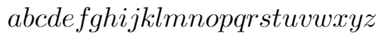 |
| Capitals | 775×57 | 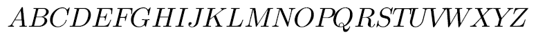 |
| CapitalGreeks | 713×51 | 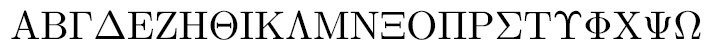 |
| Greeks | 546×58 | 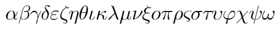 |
| Numbers | 220×49 | 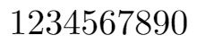 |
| Color | 59×49 | 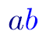 |
| Commands | 365×60 | 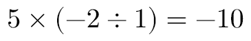 |
| Exponential | 55×54 | 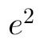 |
| ExponentWithFraction | 65×60 | 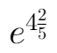 |
| ExponentWithPi | 72×54 | 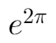 |
| ExponentWithProduct | 71×54 | 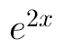 |
| Fraction | 60×103 | 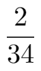 |
| FractionNested | 147×130 | 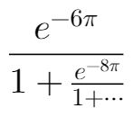 |
| FractionWithRoot | 74×112 | 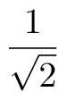 |
| FunctionDomainCodomain | 178×57 | 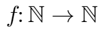 |
| IntPlusFraction | 109×103 | 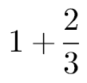 |
| BraSum | 203×132 | 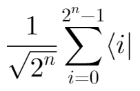 |
| KetSum | 203×132 |  |
| LargeBra | 149×108 | 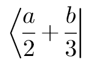 |
| LargeKet | 149×108 | 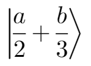 |
| LargerDelimiters | 245×100 | 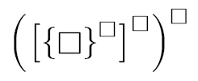 |
| IntegralScripts | 356×121 | 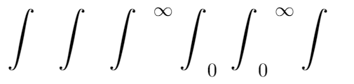 |
| ItalicScripts | 353×74 | 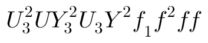 |
| LeftRight | 94×106 | 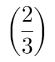 |
| LeftRightMinus | 125×106 | 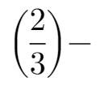 |
| LeftSide | 311×156 | 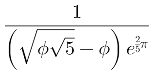 |
| FractionNestedDeep | 612×170 | 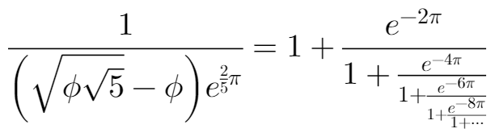 |
| LnEquation | 371×103 | 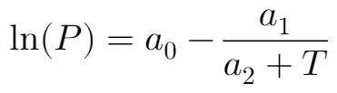 |
| Logic | 487×60 | 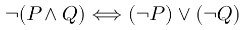 |
| Nothing | 52×48 |  |
| Phi | 45×57 | 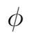 |
| Pi | 44×39 | 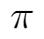 |
| QuadraticFormula | 376×122 | 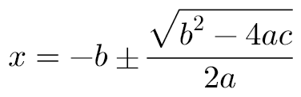 |
| ShortIntegral | 77×127 | 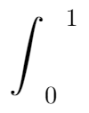 |
| SimpleLimit | 193×73 | 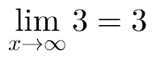 |
| SummationBigCup | 132×100 | 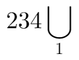 |
| SummationDouble | 143×77 | 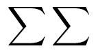 |
| SummationWithBigLimits | 109×158 | 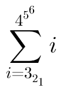 |
| SummationWithCup | 387×124 | 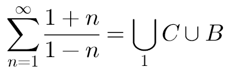 |
| SummationWithLimits | 78×124 | 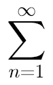 |
| QuarticSolutions | 508×197 | 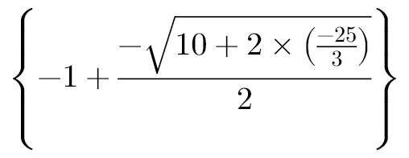 |
| Radical | 74×63 | 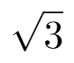 |
| RadicalFraction | 143×112 | 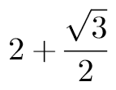 |
| RadicalNested | 117×95 | 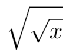 |
| RadicalNestedDeep | 366×243 | 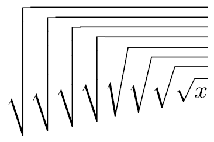 |
| RadicalPower | 113×78 | 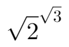 |
| RadicalSum | 143×63 | 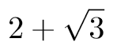 |
| RightSide | 268×170 | 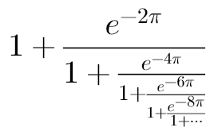 |
| TangentPeriodShift | 424×107 | 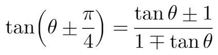 |
| TwoSin | 96×48 | 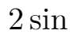 |
| Abs | 397×99 | 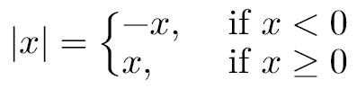 |
| AccentOver | 43×51 | 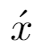 |
| AccentOverMultiple | 120×62 |  |
| ArcsinSin | 559×93 |  |
| Cases | 402×60 |  |
| EvalIntegral | 282×138 |  |
| Integral | 363×128 |  |
| SolveEquations | 399×62 |  |
| Underbrace | 100×70 |  |
| UnderbraceSubscript | 454×86 |  |
| AccentOverF | 44×68 |  |
| Choose | 96×106 |  |
| Matrix | 145×84 |  |
| BMartix | 387×60 |  |
| Overline | 175×58 |  |
| Underline | 198×58 |  |
| SimpleShortProof | 217×85 |  |
| Taylor | 275×124 |  |
| VectorProjection | 324×67 |  |
| ModeMathAbsolute | 208×60 |  |
| ModeMathColoured | 206×102 |  |
| ModeMathOverbrace | 200×78 |  |
| ModeMathSpacing | 295×57 |  |
| ModeMathVectorArrow | 159×66 |  |
| ModeMathWideTilde | 83×60 |  |
| ModeMathAccents | 208×69 |  |
| ModeMathBlackboard | 463×56 |  |
| ModeMathCases | 336×93 |  |
| ModeMathEvaluatedAt | 87×138 |  |
| ModeMathBigOperators | 253×130 |  |
| ModeMathBoldVectors | 172×49 |  |
| ModeMathBrackets | 215×60 |  |
| ModeMathHalfOpenInterval | 105×60 |  |
| ModeMathCubeRoot | 146×63 |  |
| ModeMathDerivative | 66×104 |  |
| ModeMathTentativeBracket | 143×60 |  |
| ModeMathEmptySlots | 52×103 |  |

## With the cursor

| Name | Size | Rendering |
|---|---|---|
| CursorBeforeAFraction | 163×104 |  |
| CursorAfterALetterInTheNumerator | 163×104 |  |
| CursorInAnEmptySlot | 52×103 |  |
| CursorOverATypedFunction | 75×48 |  |

## Not yet expressible

| Name | LaTeX | Waiting on |
|---|---|---|
| AccentUnder | `\threeunderdot{x}` | accents below |
| AccentUnderThin | `\threeunderdot{i}` | accents below |
| Cyrillic | `А а\ Б б\ В в` | Cyrillic in the font |
| FontStyles | `\mathnormal F\mathrm F\mathbf F\mathcal F\mathtt F` | Styled |
| ItalicAlignment | `\colorbox{yellow}P\\\begin{array}{r}\colorbox{yellow}{PF}\end{array}` | colorbox |
| LineStyles | `a \displaystyle a \textstyle a \scriptstyle a \scriptscriptstyle a` | style commands |
| Matrixception | `\begin{Vmatrix}\begin{vmatrix}a&b\end{vmatrix}\end{Vmatrix}` | double bar delimiter |
| RaiseBox | `a\raisebox{1mu}a\raisebox{2mu}a` | raisebox |
| SomeLimit | `\lim_{x\to\infty}\frac{e^2}{1-x}=\limsup_{\sigma}5` | limsup |
